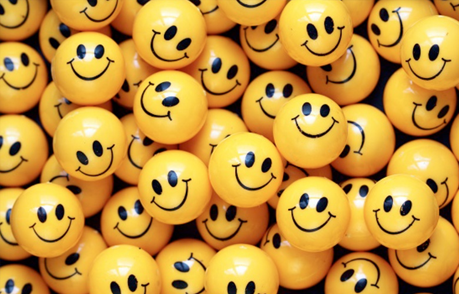
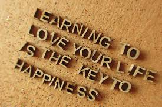

```{r setup, include=FALSE}
knitr::opts_chunk$set(echo = TRUE)
```


```{r, echo=FALSE}
# set path for data file
setwd("/Users/Boris/Documents/Fall2018-Proj1-boriszhu/doc")
```
>#**What makes people happy?**
>#**A study on Happiness from different perspectives**
Kehui Zhu  

Before you start to read this blog, I want to ask you one question: "Are you happy today?". If yes, can you think of at least 3 things to show that you are happy? Please keep the answer in your mind, as we move on, let us see if you can actually find your answer here. 

About several years ago, a very popluar interview question went virus on Internet in China: "Are you happy?" Lots of people laugh at this question, however, it reflects that when people have no problem in food and shelter, they begin to seek spiritual needs: happiness. 
\
Where does happiness come from? Personally, as a food-lover, I can be happy whenever I eat delicious foods!! 
\
In this blog, I am going to dig into the dataset: HappyDB, a corpus of 100,000 crowd-sourced happy moments, to find out "Where does happines come from in different perspectives?" Let us start!  

 

```{r, warning=FALSE, error=FALSE, echo=FALSE, message=FALSE}
# Check packages
## install and load libraries
packages.used=c("tidyverse", "dplyr", "tidytext", "DT", "scales",
                "wordcloud", "wordcloud2", "igraph","units",
                "ggraph", "tm", "lubridate", "ggplot2", "readr", "utils", "tm", "gridExtra")

# check packages that need to be installed.
packages.needed=setdiff(packages.used, 
                        intersect(installed.packages()[,1], 
                                  packages.used))
# install additional packages
if(length(packages.needed)>0){
  install.packages(packages.needed, dependencies = TRUE)
}

# load libraries
library(tidyverse)
library(dplyr)
library(tidytext)
library(DT)
library(scales)
library(wordcloud)
library(wordcloud2)
library(igraph)   # for function: graph_from_data_frame()
library(units)
library(ggraph)
library(tm)
library(lubridate)
library(ggplot2)
library(readr)
library(utils)
library(tm)
library(gridExtra)
```


```{r, load data, warning=FALSE, message=FALSE, echo=FALSE}
# Load the processed text data along with demographic information on contributors
# We use the processed data for our analysis and combine it with the demographic information available.
data <- read_csv("../output/processed_moments.csv")
urlfile<-'https://raw.githubusercontent.com/rit-public/HappyDB/master/happydb/data/demographic.csv'
demo_data <- read_csv(urlfile)
```


```{r combining data, warning=FALSE, message=FALSE, echo=FALSE}
# Combine both the data sets and keep the required columns for analysis
# We select a subset of the data that satisfies specific row conditions.
data.sb <- data %>%
  inner_join(demo_data, by = "wid") %>%
  select(wid,
         original_hm,
         gender, 
         marital, 
         parenthood,
         reflection_period,
         age, 
         country, 
         ground_truth_category, 
         text) %>%
  mutate(count = sapply(data$text, wordcount)) %>%
  filter(gender %in% c("m", "f")) %>%
  filter(marital %in% c("single", "married")) %>%
  filter(parenthood %in% c("n", "y")) %>%
  filter(reflection_period %in% c("24h", "3m")) %>%
  mutate(reflection_period = fct_recode(reflection_period, 
                                        months_3 = "3m", hours_24 = "24h"))

# From now on, we use data.sb to carry on data analysis
```


Firstly, before we dig into some specific perspectives, let us look at the whole picture. 
What are the most common words when people think of happy moments? 
```{r, warning=FALSE, message=FALSE, echo=FALSE, fig.align='center'}
# break the text into individual tokens and transform it to a tidy data structure
words.df <-  data.sb %>%
  unnest_tokens(word, text) 

# Remove those high frequence words that with themselves only can not be related to happiness. 
words.df <- words.df[words.df$word != "time" & words.df$word != "day" & words.df$word != "feel" & words.df$word != "finally" & words.df$word != "moment" & words.df$word != "enjoyed" , ]

# Count each word within the dataset
word.count <- words.df %>%
  count(word, sort = TRUE) %>%
  filter(n > 100)

# We want to see the highest frequency words
word.count %>%
  top_n(10) %>%
  mutate(word = reorder(word, n)) %>%
  ggplot(aes(word, n)) +
  geom_col(fill = "yellow3") +
  xlab("Top 10 Words Make People Happy") +
  ylab("Count") +
  coord_flip()
```

From the bar-chart, we can clearly see that "Friend" is the most frequent word that people mention when it comes to happy moment. It is so true, isn't it? Every time we spend time with our best friends, time flies!! You might laugh together, drink togerther, or even talk all night long. "Family" is the 2nd most often mentioned word when describing happy moments. I believe it is not surprising, since family members perhaps are the most important people in our whole lives. Following words such as "Watched", "Played", "Found", indicate what kind of activities would make people happy. Someone might become happy after watching one excellent movie, or for guys, playing games would make them delighted.  

\
Now, let us look at another graph using a different way of data visualization. This is called word cloud picture. The size of each word reflects the number of it in the dataset.
```{r echo=FALSE, warning=FALSE, message=FALSE, fig.align = "center"}
# WordCloud
set.seed(2018)
wordcloud(words = word.count$word, freq = word.count$n, min.freq = 1,
          max.words=200, random.order=FALSE, rot.per=0.35, 
          colors = brewer.pal(20, "Dark2"))
```

 So, still, we can see "Friend" is the largest word in the picture alongwith it's own color. "Family", "Watched", "Home" are the words around with slightly smaller font and different colors. 
Do you still remember your answer to the question at the beginning? Are you able to spot your answer in this graph? Most likely you do, since quite many "happy" words are listed here. 
\

\
After seeing a whole picture, now let us see whether we could find something interesting if we look at several groups of people. 
Since happiness is a very subjective term, let us first see how different people would interpret differently about their own happiness. 
First, we start with people from different gender groups.
```{r, warning=FALSE, message=FALSE, echo=FALSE}
frequency <- words.df %>% 
  group_by(gender) %>% 
  count(word, sort = TRUE) %>% 
  left_join(words.df %>% 
              group_by(gender) %>% 
              summarise(total = n())) %>%
  mutate(freq = n/total)

frequency <- frequency %>% 
  select(gender, word, freq) %>% 
  spread(gender, freq) %>%
  arrange(m, f)

ggplot(frequency, aes(m, f, color = f - m)) +
  geom_jitter(alpha = 0.1, size = 2.5, width = 0.25, height = 0.25) +
  geom_text(aes(label = word), check_overlap = TRUE, vjust = 1.5) +
  guides(fill=FALSE, color=FALSE) +
  scale_x_log10(labels = percent_format()) +
  scale_y_log10(labels = percent_format()) +
  geom_abline(color = "gray40", lty = 2) +
  scale_color_gradient(low = "#0091ff", high = "#f0650e") +
  xlab("Male") + ylab("Female")
```


On the graph showing above, a very interesting pattern is revealed: for females, "Boyfriend" or "Husband" would make them happy, and on the other hand, "Girl" or "Girlfriend" would make males happy. From this, we could understand better about "happiness": a great amount of happiness comes from the person we like or we love the most. Staying with them, or even just thinking of them, would always make people smile. 


\
\
Next, let us look at another way of dividing people. How would happiness be different for people in different martial states?
```{r, warning=FALSE, message=FALSE, echo=FALSE}
frequency.2 <- words.df %>% 
  group_by(marital) %>% 
  count(word, sort = TRUE) %>% 
  left_join(words.df %>% 
              group_by(marital) %>% 
              summarise(total = n())) %>%
  mutate(freq = n/total)

frequency.2 <- frequency.2 %>% 
  select(marital, word, freq) %>% 
  spread(marital, freq) %>%
  arrange(single, married)

ggplot(frequency.2, aes(single, married,  color = abs(married - single))) +
  geom_jitter(alpha = 0.1, size = 2.5, width = 0.25, height = 0.25) +
  geom_text(aes(label = word), check_overlap = TRUE, vjust = 1.5) +
  guides(fill=FALSE, color=FALSE) +
  scale_x_log10(labels = percent_format()) +
  scale_y_log10(labels = percent_format()) +
  geom_abline(color = "gray40", lty = 2) +
  scale_color_gradient(low = "#0091ff", high = "#f0650e") +
  xlab("Single") + ylab("Married")
```

A very similiar pattern appears on the graph, which is for married people: a large proportion of their happiness depends on family members, such as "Husband", "Daughter", "Kids"; while for single persons: their happiness depends on their "Girlfriend" or "Boyfriend". We also can see that "Friend" is located at the highest poistion, which again shows what we find out in the first part.

\
\
Lastly, let's look at people from different age groups. How would the age affect people's happiness? This time, people are divided into 2 groups: groups 1 are those people aged over 40; and group 2 are people under 40 years old. 
```{r echo=FALSE, warning=FALSE, message=FALSE}
age.40up <- words.df[words.df$age >= 40, ]
age.40below <- words.df[words.df$age < 40, ]

# Count each word within the dataset
up.count <- age.40up %>%
  count(word, sort = TRUE) %>%
  filter(n > 100)

below.count <- age.40below %>%
  count(word, sort = TRUE) %>%
  filter(n > 100)

# We want to see the highest frequency words
up.count %>%
  mutate(word = reorder(word, n)) %>%
  top_n(10) %>%
  ggplot(aes(word, n/sum(up.count$n))) +
  geom_col(fill = "deeppink2") +
  xlab("Top 10 Happiness for people above age 40") +
  ylab("Proportion of each Hapiness") +
  coord_flip()

below.count %>%
  top_n(10) %>%
  mutate(word = reorder(word, n)) %>%
  ggplot(aes(word, n/sum(below.count$n))) +
  geom_col(fill = "deeppink2") +
  xlab("Top 10 Happiness for people below age 40") +
  ylab("Proportion of each Hapiness") +
  coord_flip()
```

First thing we might immediately notice is that, again "Friend" takes up the largest proportion of happiness for both over and under 40 years old people. Friend is important!!
\
Secondly, we can find out another interesting point is that those who are aged over 40, most of their happiness comes from family related, such as "daughter", "son", "husband", "wife", "family", "home" and so on; while for younger people, they feel more happy when they play with friends, or play games, and not necessary from family members. 
This does make sense. When people are young, they focus more on their studies, works, entertainments. However, as people grow older, they have more time to spend with family memebers, and takes up a large part of their lives.


\
\
Instead of being happy, there is also a chance to be unhappy. Let us look at some things could cause people being negative. We carry out sentiment analysis to understand the emotional intent of the words, and categorize them into 2 groups as "Positive" and "Negative". 
```{r, warning=FALSE, message=FALSE, echo=FALSE}
bing_word_counts <- words.df %>%
  inner_join(get_sentiments("bing")) %>%
  count(word, sentiment, sort = TRUE) %>%
  ungroup()

bing_word_counts %>%
  group_by(sentiment) %>%
  top_n(10) %>%
  ungroup() %>%
  mutate(word = reorder(word, n)) %>%
  ggplot(aes(word, n, fill = sentiment)) +
  geom_col(show.legend = FALSE) +
  facet_wrap(~sentiment, scales = "free_y") +
  labs(y = "Contribution to sentiment",
       x = NULL) +
  coord_flip()

```
\
This time, let us focus on the "Unhappiness" side. What could be the reason behind "Sadness". In the bar-chart, we indeed see some words bring unhappiness, such as "hard", "lost", "unexpected", "issues", "stress" and so on. We can see that people do not like hard problems. Anything that brings issue, brings hardship, then people are easily becoming sad, and lose their "happiness". In order to keep our happiness, we should not be afraid of any issues or problems. Just do it!

```{r warning=FALSE, message=FALSE, echo=FALSE}
library(reshape2)

words.df %>%
  inner_join(get_sentiments("bing")) %>%
  count(word, sentiment, sort = TRUE) %>%
  acast(word ~ sentiment, value.var = "n", fill = 0) %>%
  comparison.cloud(colors = c("lightsteelblue3", "indianred3"),
                   max.words = 100)
```

\
We also have another word cloud grapah showing us the most frequently referred words as being positive and negative. Look at thoes red color words. Thoes are the sources of "Happiness". We want to love and smile :). And aviod those grey words.   


\
\
At the end of this blog, let us look at "happiness" not just merely based on one word, but from many words level, for most of factors are connected with each other.
\
```{r echo=FALSE, warning=FALSE, message=FALSE}
library(widyr)

# count words co-occuring within sections
word_pairs <- words.df %>%
  pairwise_count(word, wid, sort = TRUE)

# we need to filter for at least relatively common words first
word_cors <- words.df %>%
  group_by(word) %>%
  filter(n() >= 100) %>%
  pairwise_cor(word, wid, sort = TRUE)

word_cors %>%
  filter(item1 %in% c("friend", "family", "job", "played")) %>%
  group_by(item1) %>%
  top_n(6) %>%
  ungroup() %>%
  mutate(item2 = reorder(item2, correlation)) %>%
  ggplot(aes(item2, correlation)) +
  geom_bar(stat = "identity", fill = "palegreen1") +
  facet_wrap(~ item1, scales = "free") +
  xlab("Correlated Words") +
  coord_flip()
```

\
Thus, we are interested in some words that are highly correlated with each other. 
For example, when we look at 4 words: "Family", "Friends", "Job", and "Played", from the graph above, we clearly see that some happy words are highly correlated with each other. When people talk about their family, it is most likely that in family someone just had a birthday and they celebrated together; or when people talk about their jobs, it is most likely that because they receive an interview or receive a job offer makes them happy. 

 

Happiness is not like knowledge that you study and you remember it. True happiness depends on how you love your life. After going through these analysis of the report on 100,000 happy moments, "happiness" seems not to be so ambiguous anymore. Happiness is not something you can not see, acutally we are surrounded by so many happiness everyday: we have a very comfortable home, we have friends we can hang out with, and we have family members we could hug everyday! 

# STUDY WELL AND BE HAPPY!
